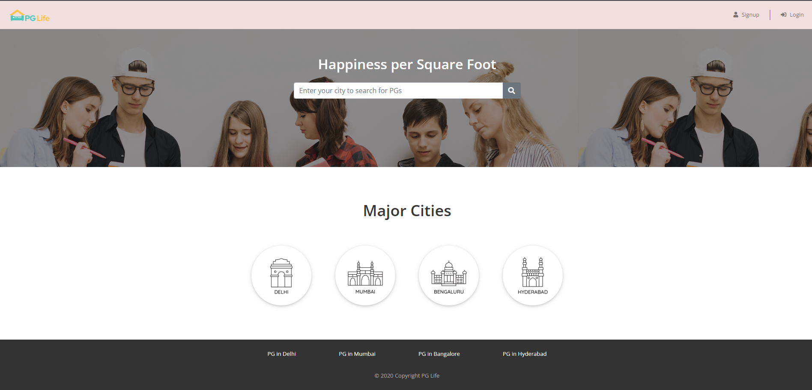
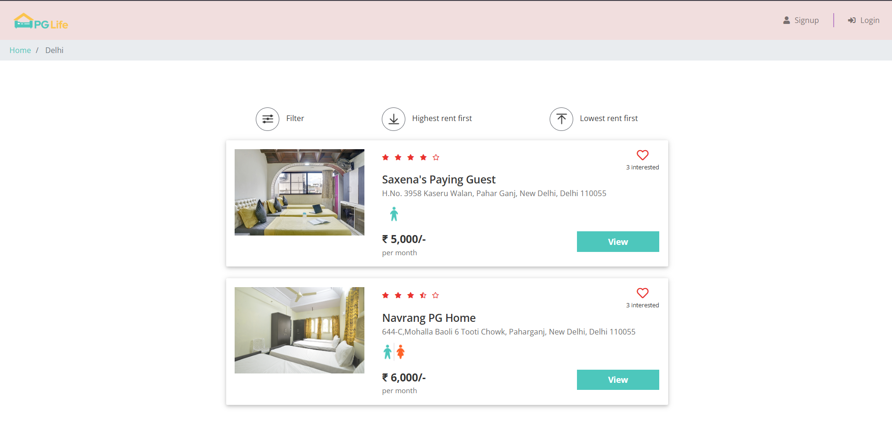
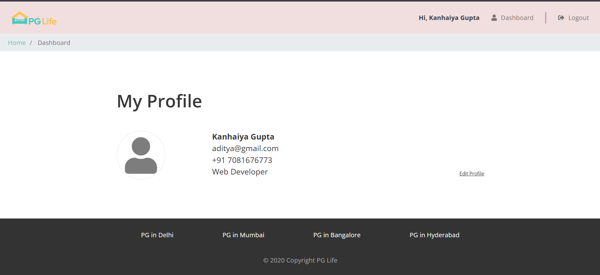

# 🏠 PG Life – Find Your Perfect Student Accommodation


**Live Demo:** [officialpglife.epizy.com](http://officialpglife.epizy.com)

PG Life is a web application designed to simplify the process of finding and securing PG (Paying Guest) accommodations for students. The platform offers seamless user authentication and a user-friendly interface to help students find PG accommodations in their preferred cities with desirable amenities.

---

## 📌 Features

- 🔐 **User Authentication**: Secure login system with password encryption.
- 🏙️ **City-Based Listings**: Browse PGs in preferred cities.
- 🛏️ **Amenity Filters**: Search for PGs with amenities like Wi-Fi, meals, parking, etc.
- 📱 **Responsive Design**: Mobile-friendly interface for seamless experience on any device.
- 🧾 **User Dashboard**: Manage preferences and bookings.
- 💬 **Reviews & Ratings**: View feedback from other users.

---

## 🛠️ Tech Stack

- **Frontend**: HTML, CSS, JavaScript
- **Backend**: PHP
- **Database**: MySQL
- **Additional Tools**: Bootstrap, AJAX

---

## 🚀 Getting Started

### Prerequisites

- [XAMPP](https://www.apachefriends.org/index.html) or any other PHP server
- Web browser

### Installation

1. **Clone the repository:**

   ```bash
   git clone https://github.com/codekanhaiya/pglife.git
   ```

2. **Setup on XAMPP:**

- Place the cloned folder inside the htdocs directory of XAMPP.

- Start Apache and MySQL from the XAMPP control panel.

3. **Database Configuration:**

- Open phpMyAdmin.

- Create a new database named pglife.

- Import the pglife.sql file located in the project root to this database.

4. **Run the Application:**

- Navigate to http://localhost/pglife/index.php in your web browser.

## 📸 Screenshots

### 🏠 Home Page:



---

### 🏢 Property Listings:



---

### 👤 Dashboard:



## 🤝 Contributing
Contributions are welcome! Please fork the repository and submit a pull request for any enhancements or bug fixes.


## 📬 Contact
For any queries or suggestions, feel free to reach out:

- GitHub: codekanhaiya

- Email: kanhaiyaguptaksg@gmail.com
